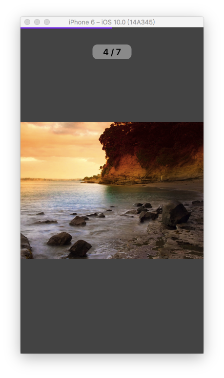

# ImageGuy
### 支持swift3.0 的图片浏览器（新浪微博类似的图片浏览器）  
### 利用UICollectionView实现的类似图片浏览器，有计数、网络图片环形进度条、缩放等功能  

## 屏幕截图
  
  


## 用法
```swift
let imageUrls = [
            "http://tse1.mm.bing.net/th?id=OIP.M798d6b715a30f5eac40989d9171ab123o0&pid=15.1",
            "http://img2.3lian.com/2014/f5/165/d/118.jpg",
            "http://img.cxdq.com/d1/file/2010/06-22/d8d7f58e1e2363d48eb4256a8b7174aa.jpg",
            "http://img.cxdq.com/d1/file/2010/06-22/9fc70fdef3e1b0b9205d9717cbf2db0c.jpg",
            "http://img.cxdq.com/d1/file/2010/06-22/78dc87139b1799654dd6fc2524eb749a.jpg",
            "http://img.funshion.com/pictures/605/159/605159.jpg",
            "http://img.zcool.cn/community/0101f856cfff206ac7252ce6214470.jpg"
            ]
let vc = ImageGuyViewController(urlStrings: imageUrls, currentIndex: 3)
/// 可以通过设置vc.placeHolder来设置展位图片
/// 可以使用这种modal方式，也可以自己写转场动画（框架暂时没有自带，之后会考虑完善）
present(vc, animated: true, completion: nil)
```
